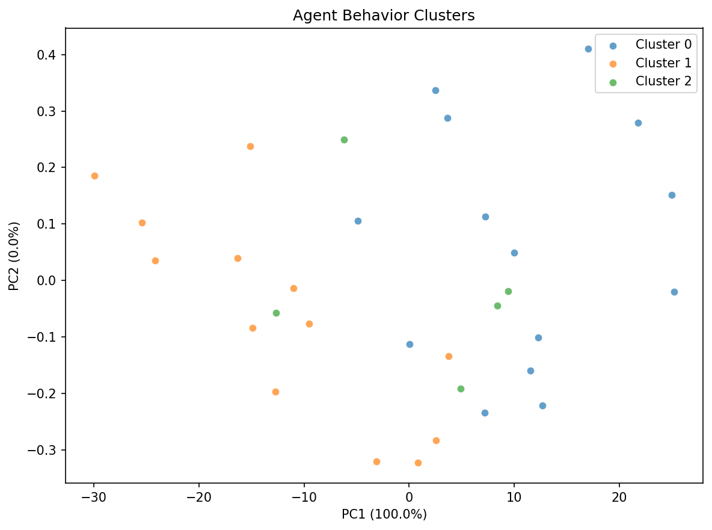
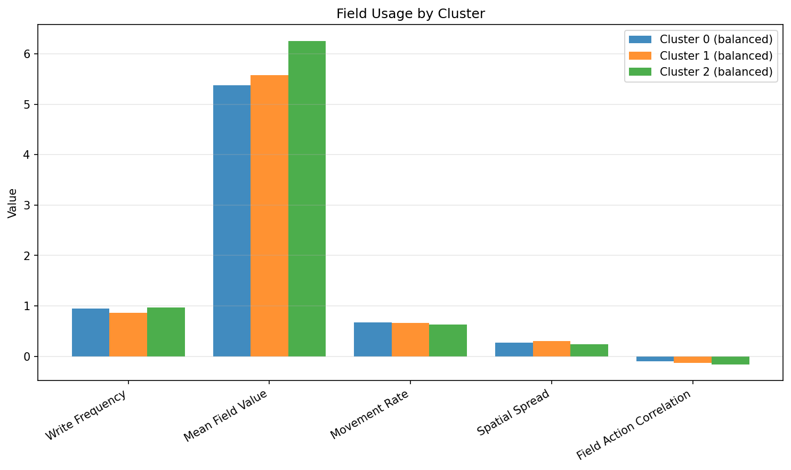

# Specialization Analysis Report

## Overview

- **Grid size**: 20x20
- **Max agents**: 32
- **Alive agents**: 32
- **Trajectory episodes recorded**: 5
- **Mutation std**: 0.01
- **Evolution enabled**: True

## Specialization Score

**Composite Score: 0.3105** (0 = identical, 1 = fully specialized)

| Component | Score |
|-----------|-------|
| Silhouette | 0.2736 |
| Weight Divergence | 0.0000 |
| Behavioral Variance | 0.6948 |
| Optimal Clusters (k) | 3 |

## Weight Divergence

- **Mean divergence**: 0.000000
- **Max divergence**: 0.000000
- **Agents compared**: 32

## Species Detection

- **Species detected**: 0
- **Silhouette**: 0.2736
- **Optimal k**: 3
- **Heredity score**: 0.0000
- **Speciation observed**: No

## Field Usage by Cluster

- **Clusters analyzed**: 3

| Cluster | Role | Write Freq | Mean Field | Movement | Spread | Field-Action Corr |
|---------|------|------------|------------|----------|--------|-------------------|
| 0 | balanced | 0.949 | 5.371 | 0.672 | 0.274 | -0.097 |
| 1 | balanced | 0.866 | 5.580 | 0.667 | 0.303 | -0.130 |
| 2 | balanced | 0.970 | 6.256 | 0.631 | 0.235 | -0.160 |

## Visualizations

All figures saved to the `figures/` subdirectory:

- `behavior_clusters_pca.png` — PCA scatter of agent behaviors
- `behavior_clusters_tsne.png` — t-SNE scatter of agent behaviors
- `weight_divergence.png` — Weight divergence over training
- `field_usage.png` — Field usage metrics by cluster
- `specialization_score.png` — Specialization score over training
