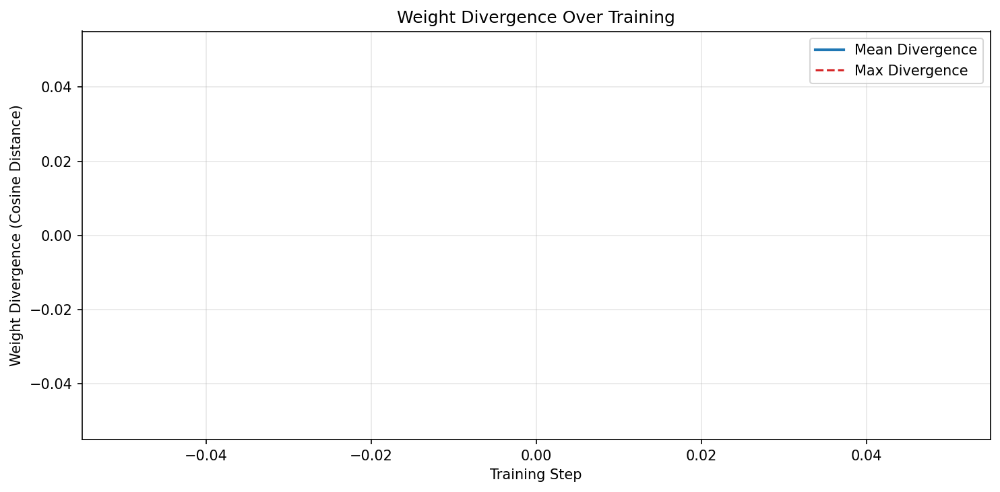
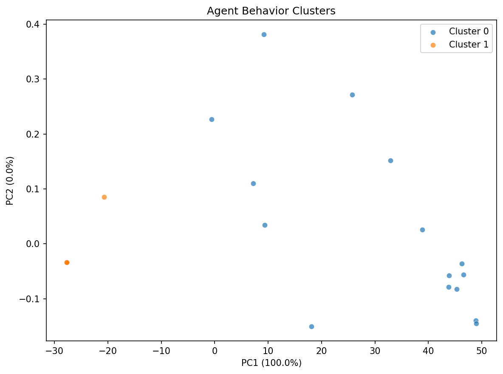
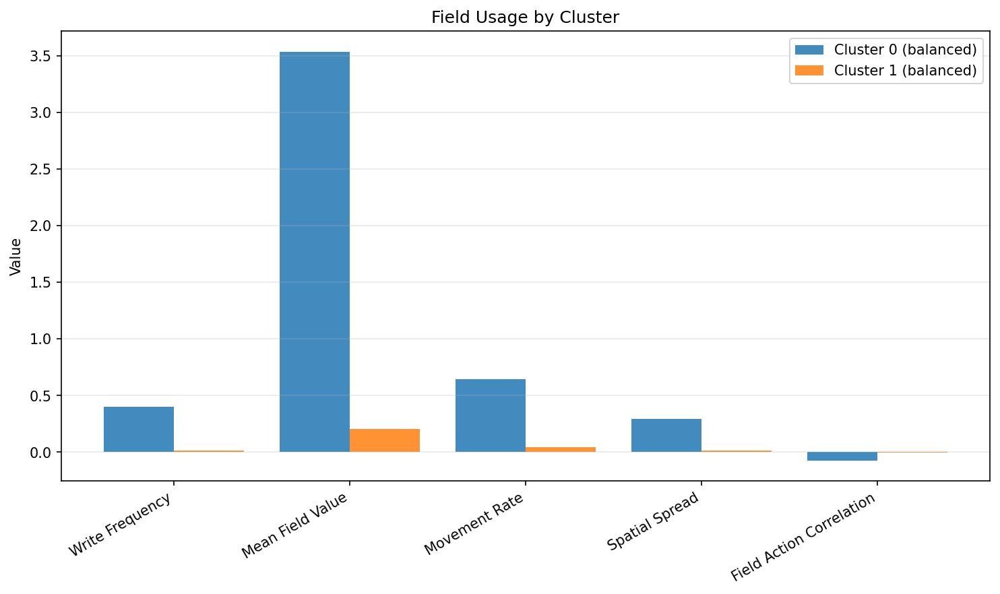

# Specialization Analysis Report

## Overview

- **Grid size**: 20x20
- **Max agents**: 32
- **Alive agents**: 0
- **Trajectory episodes recorded**: 5
- **Mutation std**: 0.01
- **Evolution enabled**: True

## Specialization Score

**Composite Score: 0.5849** (0 = identical, 1 = fully specialized)

| Component | Score |
|-----------|-------|
| Silhouette | 0.8225 |
| Weight Divergence | 0.0000 |
| Behavioral Variance | 0.6948 |
| Optimal Clusters (k) | 2 |

## Weight Divergence

- **Mean divergence**: 0.000000
- **Max divergence**: 0.000000
- **Agents compared**: 0

## Species Detection

- **Species detected**: 2
- **Silhouette**: 0.8225
- **Optimal k**: 2
- **Heredity score**: 0.0000
- **Speciation observed**: Yes

### Detected Species

| Species | Members | Heredity | Role | Key Features |
|---------|---------|----------|------|--------------|
| Cluster 0 | 15 | 1.00 | unknown | movement_entropy=0.857, food_collection_rate=0.607, distance_per_step=0.593 |
| Cluster 1 | 17 | 1.00 | unknown | movement_entropy=0.011, food_collection_rate=0.005, distance_per_step=0.009 |

## Field Usage by Cluster

- **Clusters analyzed**: 2

| Cluster | Role | Write Freq | Mean Field | Movement | Spread | Field-Action Corr |
|---------|------|------------|------------|----------|--------|-------------------|
| 0 | balanced | 0.403 | 3.536 | 0.647 | 0.294 | -0.073 |
| 1 | balanced | 0.015 | 0.205 | 0.044 | 0.014 | -0.005 |

## Visualizations

All figures saved to the `figures/` subdirectory:

- `behavior_clusters_pca.png` — PCA scatter of agent behaviors
- `behavior_clusters_tsne.png` — t-SNE scatter of agent behaviors
- `weight_divergence.png` — Weight divergence over training
- `field_usage.png` — Field usage metrics by cluster
- `specialization_score.png` — Specialization score over training
